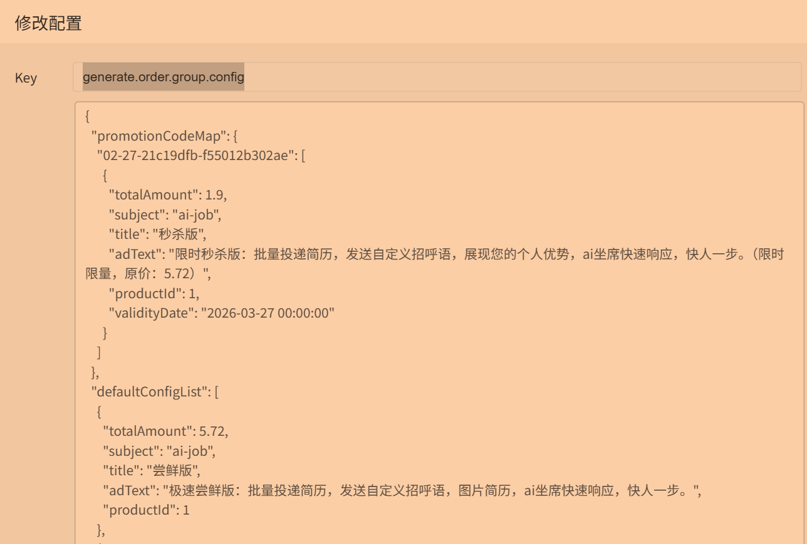
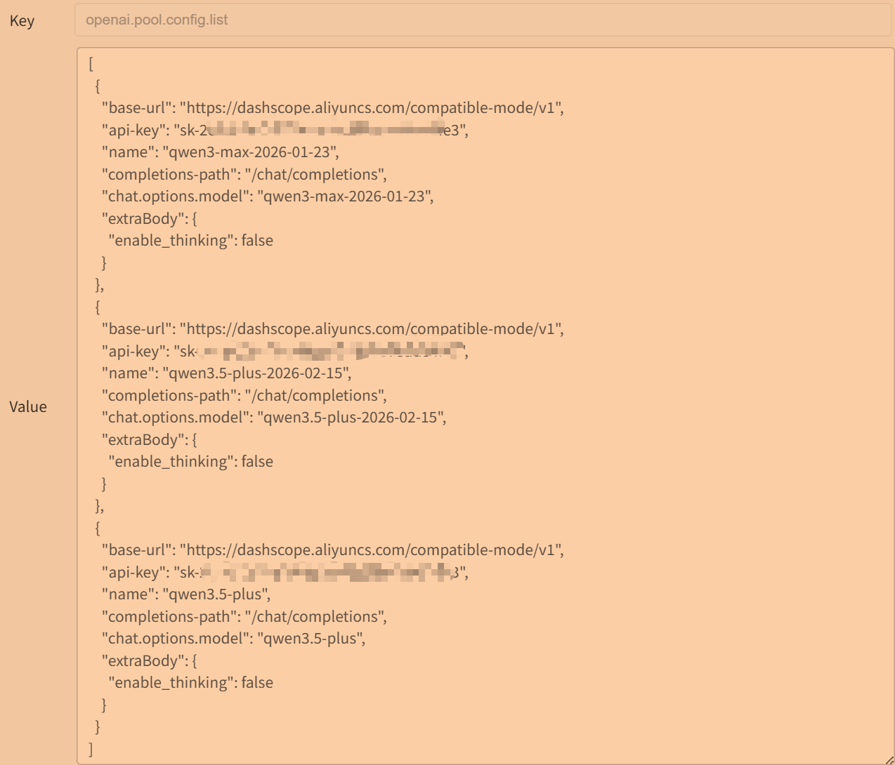

## 配置相关

### application

#### AI相关
- 需要配置kimi，用于ocr识别简历内容，直接在官方平台申请就好了，文件识别存储是免费的。限量1000个文件，程序中有定时任务自动删除文件。

#### 支付相关
- 如果是自用，不需要配置，直接删除相应key即可。
- 如果是部署赚米，在支付宝开放平台获取对应的配置即可

#### smart-config
- 用于动态配置管理页面的用户名和密码
- 后续可通过ip:6768访问配置后台，调整参数

#### 数据库
- 通过resources中的schema.sql创建相关数据库表
- 然后在properties中配置你相应的域名，用户名，密码。

#### login-Filter.freeLoginArray
-当前配置为免登配置，如果有需要可以新增，尽量不要删减

#### openai.pool.config.list
- ai会话交互所需要的apikey池
- 配置对应的base-url和api-key以及模型名称

### 核心配置
> 可通过你的域名:smart-config指定的端口访问,其中的业务配置都是动态更新的，你可以及时修改

#### generate.order.group.config
- 产品列表，用于生成订单

#### openai.pool.config.list
- ai坐席，ai过滤，ai招呼语的apikey

### Email通知
> 用于系统让你发送邮件通知，包含ai服务状态等

修改mail.setting中配置

## 注意事项
- 服务器除本地部署外，需要使用ssl，因为需要在boss域名访问你的目标域名，boss使用的是https，你也需要使用https
- 项目使用jdk17，springboot3